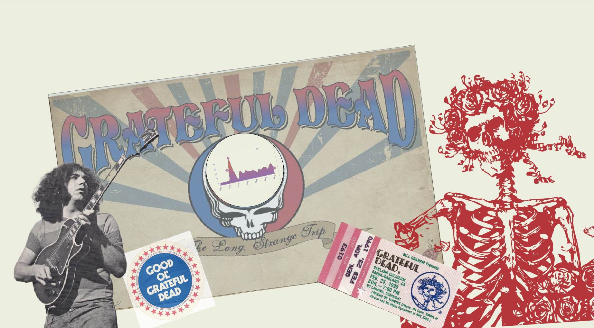

## Darkstar project / GRATEFUL DATA

## What is this?

Grateful Data is a website that uses data visualizations to describe the career arc of the pioneering jam band and psychedelic phenomenon, The Grateful Dead. View the visualizations here - https://grateful-data.com

### Inspiration

I've been facinated by Data visualization work as a reader long before I ever started programming. Sites like FiveThiryEight, The Pudding, and The New York Times Upshot and Infographics sections. Although I'm an avid reader, I also am a visual learner and well crafted piece of data journalism can help me understand complex topics quickly and concisely.

Data Visualization combines the worlds of code, mathematics, design and storytelling.

I that started as I was beginning to explore the world of data visualizations with D3 and SVG animations

Experimental work for this project can be seen here at Observable which can offer insight as to most the the methodology in creating the graphs.
https://observablehq.com/collection/@michaeladamberry/darkstar-project

### Goals

1. Get to know the D3.js API by building things. The D3 ecosystem is quite large, so to truly get a grasp around it, I wanted to use a project that would explore as many D3 features as possible

2. Build an application without React. As I really only began web developement after the phenomenon of component based frameworks like React, Angular, and Vue-- I wanted to understand what the challenges and /or benefits there would be from working without these tools. I ended up using d3's very jQuery-like methods to select and maninpulate DOM elements.

3. Improve my understanding and skills of building and animating svg graphics.

4. Listen to a lot of Grateful Dead. (Ok yeah this one I probably would have done anyways :) )

5. Improve my interactive and informatic design skills--Always fun. Always much, much harder than I think

### Explorations

#### For the bands entire career:

- what songs were played the most?
- How can we think about bredth of the full repetoir visually?

#### For each year:

- what songs were played the most?
- what songs were played for the first time?

#### For each song:

- when was the song first played?
- what year was the song played the most?
- when year was the song last played?

### Basic Data Gathering Methodology

I wrote Javascript functions to query the Setlist.fm API and write a json file that is a detailed list of as statistics setlist.fm has for every concert the Grateful Dead played. You can see this full list in data/grateful-setlist.json

This data was parsed and formatted into several other json two files that the visualizations use. The data can be broken down into three catagories: full career statistics, statistics for each year, and statistics for each song.

### Challenges

Things I would do differently in hind sight :

- SVG The main SVG charts inside the skull graphic were achieved by essentially layering one svg overtop of a second which seemed to be the simplest situation. This resulted in wasted time as the image needed to scale for various screen sizes.

- the mobile design changed significatly after recieving feedback from design collaborator. The CSS is ordered and designed with an older model in mind.

-spend more time at the beginning protoyping different types of charts

### Next Steps

- I am interested in creating several more charts in the future. In particular I'm interested in dot matrix graphics that will show the songs associated with the bands singers which will be filled in color based on the cooresponding lryicist.

- After reaching out to Susie Lu, whose Front End Masters Course was helpful in learning more about D3 and it's working relationship with React it was suggested that the radial bar chart is considered by many to be a chart which innacurately represents data. I'd like to spend some time exploring other options on Observable.

- The Song Area graph still seems a little bland. I'd like to explore adding interactivity so the user could see information of each specific show based on the cursor position. This would drastically increase the size of the data so performance could be an issue.

- Still a few areas where performance could be improved and duplicate code deleted. Tidying up ect.

### Contributing

If anyone is interested in contributing or has any ideas feel free to reach out.
